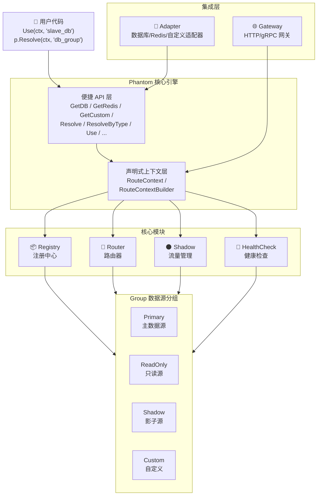
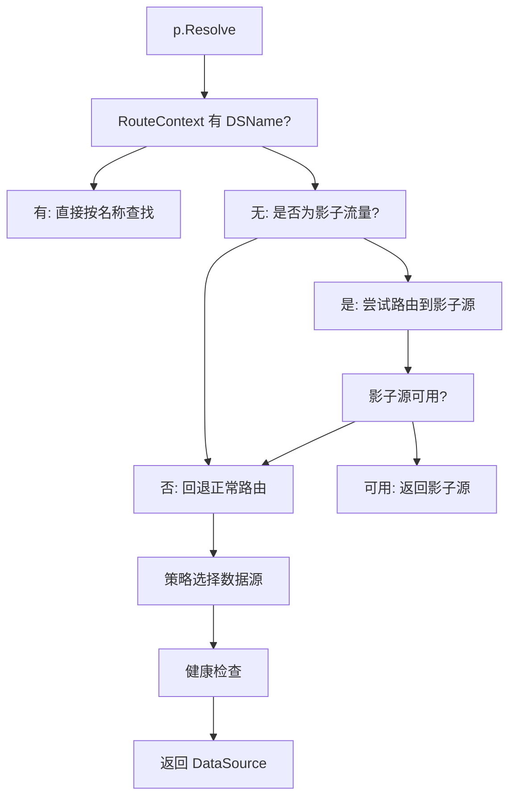

# Go-Phantom

> Go-Phantom 是一个动态数据隔离引擎，提供声明式数据源切换、影子流量隔离、多租户路由、健康检查和故障转移等企业级特性，灵感来源于 MyBatis-Plus 的动态数据源切换机制；采用**分层解耦**架构，以 Phantom 核心引擎为入口，向下协调四大子模块（Registry、Router、ShadowManager、HealthCheckManager），每个模块职责单一、可独立扩展

[](https://github.com/kamalyes/go-phantom)
[]()
[]()
[]()
[]()
[]()
[]()
[]()
[]()
[]()
[]()
[]()
[](https://codecov.io/gh/kamalyes/go-phantom)
[](https://goreportcard.com/report/github.com/kamalyes/go-phantom)
[](https://pkg.go.dev/github.com/kamalyes/go-phantom?tab=doc)
[](https://sourcegraph.com/github.com/kamalyes/go-phantom?badge)

***

## 🏗️ 架构设计

### 架构总览



### 核心模块职责

| 模块              | 源文件                                 | 职责                      | 关键类型                                             |
| --------------- | ----------------------------------- | ----------------------- | ------------------------------------------------ |
| **Phantom**     | [phantom.go](phantom.go)            | 核心引擎入口，协调所有子模块，提供便捷 API | `Phantom`, `PhantomOption`                       |
| **Context**     | [context.go](context.go)            | 路由上下文管理，声明式切换的载体        | `RouteContext`, `RouteContextBuilder`            |
| **Registry**    | [registry.go](registry.go)          | 数据源分组的注册、查询与移除          | `Registry`, `Group`, `DataSource`                |
| **Router**      | [router.go](router.go)              | 路由策略定义，8 种内置策略          | `Strategy`, `RouteResult`                        |
| **RouterGroup** | [router\_group.go](router_group.go) | 分组与策略的映射管理              | `Router`                                         |
| **Shadow**      | [shadow.go](shadow.go)              | 影子流量识别与管理               | `ShadowManager`, `ShadowRule`, `ShadowMatchRule` |
| **Health**      | [health.go](health.go)              | 数据源健康检查                 | `HealthCheckManager`, `HealthChecker`            |
| **Config**      | [config.go](config.go)              | 配置驱动构建                  | `ConfigDrivenBuilder`, `PhantomConfig`           |
| **Gateway**     | [gateway.go](gateway.go)            | HTTP/gRPC 网关集成          | `GatewayMiddleware`, `GRPCInterceptor`           |
| **Errors**      | [errors.go](errors.go)              | 哨兵错误定义                  | `GroupError`, `SourceError`                      |

### 数据流

一次完整的路由请求流程如下：



***

## 🚀 快速开始

### 环境要求

需要 [Go](https://go.dev/) 版本 [1.25](https://go.dev/doc/devel/release#go1.25.0) 或更高版本

### 安装

```sh
go get -u github.com/kamalyes/go-phantom
```

### 5分钟入门

```go
package main

import (
    "context"
    "fmt"

    "github.com/kamalyes/go-phantom"
)

func main() {
    p := phantom.NewPhantom()

    dbGroup := phantom.NewGroup("db_group", phantom.StorageDatabase)
    dbGroup.AddSource(&phantom.DataSource{Name: "primary_db", StorageType: phantom.StorageDatabase})
    dbGroup.AddSource(&phantom.DataSource{Name: "slave_db", StorageType: phantom.StorageDatabase, ReadOnly: true})

    p.RegisterGroup(dbGroup)
    p.SetDefaultGroup(phantom.StorageDatabase, "db_group")
    p.SetGroupStrategy("db_group", "primary")
    p.Initialize(context.Background())

    source, _ := p.Resolve(context.Background(), "db_group")
    fmt.Println("默认数据源:", source.Name) // primary_db

    ctx := phantom.Use(context.Background(), "slave_db")
    source, _ = p.Resolve(ctx, "db_group")
    fmt.Println("切换后数据源:", source.Name) // slave_db

    p.Close()
}
```

> 📖 更详细的教程请查看 [快速开始](docs/quickstart.md)

***

## 🧩 核心概念

### 数据源分组（Group）

数据源分组是管理同一类型下多个数据源的容器：

```go
group := phantom.NewGroup("db_group", phantom.StorageDatabase)

group.AddSource(&phantom.DataSource{Name: "primary", StorageType: phantom.StorageDatabase})
group.AddSource(&phantom.DataSource{Name: "readonly", StorageType: phantom.StorageDatabase, ReadOnly: true})
group.AddSource(&phantom.DataSource{Name: "shadow", StorageType: phantom.StorageDatabase, Shadow: true})

ds := group.GetSource("primary")
healthy := group.GetHealthySources()
shadows := group.GetHealthyShadows()
readOnly := group.GetReadOnlySources()
```

### 声明式切换

通过上下文 API 在业务代码中声明要使用的数据源，无需修改路由逻辑：

```go
ctx := phantom.Use(ctx, "slave_db")           // 指定数据源名称
ctx = phantom.WithShadow(ctx, true)           // 标记影子流量
ctx = phantom.WithTenant(ctx, "tenant_1")     // 设置租户ID
ctx = phantom.WithReadOnly(ctx, true)         // 标记只读请求
ctx = phantom.WithRouteHint(ctx, "hint_ds")   // 设置路由提示
ctx = phantom.WithGroup(ctx, "my_group")      // 指定分组名称

dsName := phantom.CurrentDS(ctx)              // 获取当前数据源名称
```

### RouteContextBuilder

使用构建器模式一次性构建路由上下文，避免多次 Clone 造成的堆分配：

```go
routeCtx := phantom.NewRouteContextBuilder().
    DSName("slave_db").
    Shadow(true).
    TenantID("tenant_1").
    ReadOnly(false).
    RouteHint("hint").
    Extra("key1", "value1").
    Build()

ctx := phantom.WithRouteContext(context.Background(), routeCtx)
```

### Phantom 便捷 API

Phantom 引擎提供多种便捷方法，按存储类型快速获取数据源：

```go
// 按分组名称解析
source, err := p.Resolve(ctx, "db_group")

// 使用指定路由上下文解析
source, err := p.ResolveWithRoute(ctx, "db_group", routeCtx)

// 按存储类型解析（使用默认分组）
source, err := p.ResolveByType(ctx, phantom.StorageDatabase)

// 便捷方法 - 获取数据库数据源
source, err := p.GetDB(ctx)
source, err := p.GetDB(ctx, "custom_db_group") // 指定分组

// 便捷方法 - 获取 Redis 数据源
source, err := p.GetRedis(ctx)
source, err := p.GetRedis(ctx, "custom_redis_group")

// 便捷方法 - 获取自定义类型数据源
source, err := p.GetCustom(ctx, phantom.StorageCustom)
```

***

## 🎯 路由策略

### 内置策略

| 策略                 | 名称           | 适用场景 | 说明                |
| ------------------ | ------------ | ---- | ----------------- |
| PrimaryStrategy    | `primary`    | 写操作  | 始终选择主数据源          |
| ReadOnlyStrategy   | `readonly`   | 读操作  | 优先选择只读数据源，无则回退主库  |
| ReadWriteStrategy  | `readwrite`  | 读写分离 | 根据只读标记自动选择读写库     |
| TenantStrategy     | `tenant`     | 多租户  | 按租户ID路由到对应数据源     |
| RoundRobinStrategy | `roundrobin` | 负载均衡 | 原子计数器轮询选择         |
| WeightedStrategy   | `weighted`   | 加权负载 | 按权重随机选择           |
| HintStrategy       | `hint`       | 定向路由 | 按路由提示选择指定数据源      |
| FailoverStrategy   | `failover`   | 高可用  | 故障转移，自动尝试下一个健康数据源 |

### 使用策略

```go
p.SetGroupStrategy("db_group", "readwrite")

p.SetGroupStrategy("db_group", "roundrobin")
```

### 扩展策略

```go
composite := strategy.NewCompositeStrategy(
    &phantom.TenantStrategy{},
    &phantom.PrimaryStrategy{},
)

fnStrategy := strategy.NewFuncStrategy("my_strategy", func(ctx context.Context, group *phantom.Group, routeCtx *phantom.RouteContext) (*phantom.RouteResult, error) {
    return &phantom.RouteResult{Source: group.Primary, GroupName: group.Name}, nil
})
```

> 📖 详细的策略说明和示例请查看 [路由策略详解](docs/routing-strategies.md)

***

## 🌑 影子流量隔离

```go
p.RegisterShadowRule("db_group", &phantom.ShadowRule{
    Enabled:     true,
    Logic:       phantom.ShadowLogicOR,
    GroupName:   "db_group",
    ShadowDS:    "shadow_db",
    ShadowTable: "shadow_",
    MatchRules: []*phantom.ShadowMatchRule{
        {Type: phantom.ShadowMatchTag, Values: []string{"pressure_test"}},
        {Type: phantom.ShadowMatchTenantID, Values: []string{"test_tenant"}},
        {Type: phantom.ShadowMatchUserID, Values: []string{"user_001"}},
        {Type: phantom.ShadowMatchPercent, Percent: 10},
        {Type: phantom.ShadowMatchHeader, Key: "X-Shadow", Values: []string{"true"}},
        {Type: phantom.ShadowMatchCustom, Matcher: func(ctx context.Context) bool {
            return true
        }},
    },
})

// 判断是否为影子流量
isShadow := p.IsShadowTraffic(ctx, "db_group")

// 检查影子流量是否启用
enabled := p.IsShadowEnabled("db_group")
```

### 匹配规则类型

| 类型                       | 名称          | 说明                          |
| ------------------------ | ----------- | --------------------------- |
| ShadowMatchHeader        | `header`    | 匹配请求头中的指定键值                 |
| ShadowMatchUserID        | `user_id`   | 匹配用户ID                      |
| ShadowMatchTenantID      | `tenant_id` | 匹配租户ID                      |
| ShadowMatchIPRange       | `ip_range`  | 匹配IP范围                      |
| ShadowMatchPercent       | `percent`   | 百分比分流（FNV-1a 哈希，稳定分流）       |
| ShadowMatchTag           | `tag`       | 标签匹配（不区分大小写）                |
| ShadowMatchCustom        | `custom`    | 自定义匹配函数                     |

> 📖 完整的影子流量配置请查看 [影子流量隔离](docs/shadow-traffic.md)

***

## 🏥 健康检查

```go
p := phantom.NewPhantom(
    phantom.WithHealthCheck(phantom.HealthCheckConfig{
        Enabled:  true,
        Interval: 5 * time.Second,
        Timeout:  2 * time.Second,
    }),
)

p.RegisterHealthChecker(phantom.StorageCustom, &MyHealthChecker{})

health := p.HealthCheck()
```

### 内置健康检查器

| 存储类型               | 检查器                   | 检查方式                          |
| ------------------ | --------------------- | ----------------------------- |
| StorageDatabase    | `DBHealthChecker`     | 通过 `PingContext` 检查数据库连接可用性    |
| StorageRedis       | `RedisHealthChecker`  | 通过 `Ping` 命令检查 Redis 连接可用性     |
| StorageCustom      | `GenericHealthChecker` | 检查实例是否存在                       |

> 默认配置：`Interval=10s`, `Timeout=3s`

> 📖 详细的健康检查配置请查看 [健康检查](docs/health-check.md)

***

## 🔌 适配器

### Database 适配器（GORM）

```go
dbAdapter := adapter.NewDatabaseAdapter()

db, err := dbAdapter.Resolve(ctx, p, "db_group")

dbAdapter.Execute(ctx, p, "db_group", func(ctx context.Context, db *gorm.DB) error {
    return db.Create(&User{Name: "test"})
})

dbAdapter.ExecuteWithDS(ctx, p, "db_group", "slave_db", func(ctx context.Context, db *gorm.DB) error {
    return db.Find(&users).Error
})

dbAdapter.Transaction(ctx, p, "db_group", func(ctx context.Context, tx *gorm.DB) error {
    return tx.Create(&User{Name: "test"}).Error
})

dbAdapter.TransactionWithDS(ctx, p, "db_group", "primary_db", func(ctx context.Context, tx *gorm.DB) error {
    return tx.Create(&User{Name: "test"}).Error
})

dbAdapter.DualWrite(ctx, p, adapter.DualWriteOption{
    PrimaryGroup: "db_group",
    ShadowGroup:  "shadow_group",
    ShadowAsync:  true,
    ShadowSilent: true,
}, func(ctx context.Context, db *gorm.DB) error {
    return db.Create(&User{Name: "test"}).Error
})

dbAdapter.DualWriteTransaction(ctx, p, adapter.DualWriteOption{
    PrimaryGroup: "db_group",
    ShadowGroup:  "shadow_group",
}, func(ctx context.Context, tx *gorm.DB) error {
    return tx.Create(&User{Name: "test"}).Error
})
```

### Redis 适配器

```go
redisAdapter := adapter.NewRedisAdapter()

client, err := redisAdapter.Resolve(ctx, p, "redis_group")

redisAdapter.Execute(ctx, p, "redis_group", func(ctx context.Context, client *redis.Client) error {
    return client.Set(ctx, "key", "value", 0).Err()
})

redisAdapter.ExecuteWithDS(ctx, p, "redis_group", "slave_redis", func(ctx context.Context, client *redis.Client) error {
    return client.Get(ctx, "key").Err()
})
```

### Custom 泛型适配器

```go
customAdapter := adapter.NewCustomAdapter[*MyStorage](phantom.StorageCustom)

instance, err := customAdapter.Resolve(ctx, p, "my_group")

customAdapter.Execute(ctx, p, "my_group", func(ctx context.Context, instance *MyStorage) error {
    return instance.DoSomething()
})

customAdapter.ExecuteWithDS(ctx, p, "my_group", "custom_ds", func(ctx context.Context, instance *MyStorage) error {
    return instance.DoSomething()
})
```

***

## 🌐 网关集成

### HTTP 中间件

```go
gm := phantom.NewGatewayMiddleware(p, "X-Phantom-")
handler := gm.Middleware(http.HandlerFunc(func(w http.ResponseWriter, r *http.Request) {
    source, _ := p.Resolve(r.Context(), "db_group")
    fmt.Fprintln(w, source.Name)
}))
http.Handle("/api", handler)
```

支持的请求头：`X-Phantom-DS`、`X-Phantom-Shadow`、`X-Phantom-Tenant`、`X-Phantom-ReadOnly`、`X-Phantom-Hint`

### gRPC 拦截器

```go
gi := phantom.NewGRPCInterceptor(p, "phantom-")

// 在 gRPC 拦截器中提取路由上下文
func interceptor(ctx context.Context, req interface{}, info *grpc.UnaryServerInfo, handler grpc.UnaryHandler) (interface{}, error) {
    ctx = gi.ExtractRouteContext(ctx)
    return handler(ctx, req)
}

server := grpc.NewServer(grpc.UnaryInterceptor(interceptor))
```

> 📖 完整的网关集成教程请查看 [网关集成](docs/gateway-integration.md)

***

## ⚙️ 配置驱动

```go
config := &phantom.PhantomConfig{
    Enabled: true,
    HealthCheck: phantom.PhantomHealthCheckConfig{
        Enabled:  true,
        Interval: 10 * time.Second,
        Timeout:  3 * time.Second,
    },
    Groups: []phantom.PhantomGroupConfig{
        {
            Name:        "db_group",
            StorageType: phantom.StorageDatabase,
            Strategy:    "readwrite",
            Sources: []phantom.PhantomSourceConfig{
                {Name: "primary_db", Weight: 1},
                {Name: "slave_db", ReadOnly: true, Weight: 1},
            },
        },
    },
    DefaultGroups: map[phantom.StorageType]string{
        phantom.StorageDatabase: "db_group",
    },
}

builder := phantom.NewConfigDrivenBuilder(config)
p, err := builder.Build(context.Background())
```

> 📖 完整的配置驱动教程请查看 [配置驱动](docs/config-driven.md)

***

## 📁 项目结构

```
go-phantom/
├── phantom.go          # 核心引擎，协调所有子模块
├── context.go          # 路由上下文，声明式切换的载体
├── registry.go         # 注册中心，管理数据源分组
├── router.go           # 路由策略，8 种内置策略
├── router_group.go     # 路由器，分组与策略的映射
├── shadow.go           # 影子流量管理，多规则匹配
├── health.go           # 健康检查管理，定期检测数据源状态
├── config.go           # 配置驱动构建，支持 YAML/JSON
├── gateway.go          # 网关集成，HTTP 中间件 + gRPC 拦截器
├── errors.go           # 哨兵错误定义
├── perf_test.go        # 性能基准测试（50+ 用例）
├── adapter/
│   ├── database.go     # 数据库适配器（GORM）
│   ├── redis.go        # Redis 适配器
│   └── custom.go       # 自定义泛型适配器
├── strategy/
│   └── strategy.go     # 扩展策略（组合策略、函数策略）
├── docs/               # 使用文档
│   ├── quickstart.md           # 快速开始
│   ├── routing-strategies.md   # 路由策略详解
│   ├── shadow-traffic.md       # 影子流量隔离
│   ├── health-check.md         # 健康检查
│   ├── config-driven.md        # 配置驱动
│   └── gateway-integration.md  # 网关集成
└── *_test.go           # 测试文件（按源文件划分）
```

***

## ⚡ 性能优化

### 优化方案

| 优化项     | 方案                             | 效果                           |
| ------- | ------------------------------ | ---------------------------- |
| 数据源查找   | sourceMap O(1) 替代 O(n) 遍历      | 查找性能提升数倍                     |
| 租户查找    | tenantMap O(1) 替代 O(n) 遍历      | 10000 租户查找 \~100ns，性能不随租户数增长 |
| 健康数据源过滤 | healthyCache + dirty 标记        | 缓存命中时 0 B 分配，减少重复过滤开销        |
| 路由上下文构建 | RouteContextBuilder 替代多次 Clone | 减少堆分配                        |
| 轮询策略    | atomic 计数器替代互斥锁                | 无锁轮询选择                       |
| 随机数生成   | go-toolbox/random 替代 math/rand | 协程安全，性能更优                    |
| 并发安全    | syncx.Map 替代 sync.Map          | 类型安全，API 更友好                 |
| 锁管理     | syncx.WithLock/WithRLock       | 自动释放，防止死锁                    |
| 百分比分流   | FNV-1a 哈希                      | 稳定分流，同一标识始终路由到相同环境           |

### 性能基准测试

> 测试环境：Intel(R) Core(TM) i5-9300H CPU @ 2.40GHz / Windows / Go 1.25
>
> 完整测试用例见 [perf\_test.go](perf_test.go)

#### 路由策略

| 策略                        | 耗时            | 内存分配 | 分配次数 |
| ------------------------- | ------------- | ---- | ---- |
| PrimaryStrategy           | **1.4 ns/op** | 0 B  | 0    |
| ReadWriteStrategy (写)     | 68 ns/op      | 32 B | 1    |
| RoundRobinStrategy (10源)  | 87 ns/op      | 32 B | 1    |
| RoundRobinStrategy (100源) | 156 ns/op     | 32 B | 1    |
| HintStrategy (命中)         | 83 ns/op      | 32 B | 1    |
| HintStrategy (未命中)        | 90 ns/op      | 32 B | 1    |
| FailoverStrategy          | 68 ns/op      | 32 B | 1    |

#### 🏆 多租户 O(1) 查找

TenantStrategy 使用 `tenantMap` 实现 O(1) 查找，性能不随租户数量增长：

| 租户数量       | 查找耗时            | 内存分配     | 分配次数  |
| ---------- | --------------- | -------- | ----- |
| 10         | 84.8 ns/op      | 32 B     | 1     |
| 100        | 92.1 ns/op      | 32 B     | 1     |
| **1,000**  | **92.0 ns/op**  | **32 B** | **1** |
| 5,000      | 103.5 ns/op     | 32 B     | 1     |
| **10,000** | **133.8 ns/op** | **32 B** | **1** |

> 从 10 到 10000 租户，耗时仅增长 49ns，验证 O(1) 查找

#### Group 底层操作

| 操作                          | 耗时            | 内存分配  |
| --------------------------- | ------------- | ----- |
| GetSource (1000源)           | 39.6 ns/op    | 0 B   |
| GetSourceByTenant (1000租户)  | 32.8 ns/op    | 0 B   |
| GetSourceByTenant (10000租户) | 36.5 ns/op    | 0 B   |
| GetHealthySources (缓存命中)    | 45.8 ns/op    | 0 B   |
| GetHealthySources (缓存失效重建)  | 941.8 ns/op   | 896 B |
| DataSource.IsHealthy        | **0.8 ns/op** | 0 B   |
| DataSource.MarkHealthy      | 6.7 ns/op     | 0 B   |

#### Phantom 引擎端到端

| 场景                       | 耗时          | 内存分配 |
| ------------------------ | ----------- | ---- |
| Resolve (Primary)        | \~200 ns/op | 32 B |
| Resolve (Tenant 100租户)   | \~200 ns/op | 32 B |
| Resolve (Tenant 1000租户)  | \~200 ns/op | 32 B |
| Resolve (Tenant 10000租户) | \~232 ns/op | 32 B |
| ResolveByDSName          | \~200 ns/op | 32 B |

#### 并发性能

| 场景                          | 耗时              | 内存分配  |
| --------------------------- | --------------- | ----- |
| Phantom 并发 Primary          | \~200 ns/op     | 32 B  |
| Phantom 并发 RoundRobin       | \~127 ns/op     | 32 B  |
| **Phantom 并发 Tenant 1000**  | **\~304 ns/op** | 223 B |
| **Phantom 并发 Tenant 10000** | **\~344 ns/op** | 224 B |
| Group 并发 GetSourceByTenant  | 104 ns/op       | 21 B  |
| Group 并发 GetHealthySources  | 57 ns/op        | 0 B   |

#### 真实场景模拟

| 场景                              | 耗时            | 内存分配  |
| ------------------------------- | ------------- | ----- |
| 1000租户 + 读写分离 + 并发              | **250 ns/op** | 224 B |
| 1000租户 + 混合流量(租户/只读/影子/指定) + 并发 | **398 ns/op** | 236 B |

#### 运行基准测试

```sh
# 运行全部基准测试
go test -bench=. -benchmem -benchtime=1s -count=1 -timeout 600s .

# 只运行多租户相关
go test -bench=BenchmarkTenantStrategy -benchmem -benchtime=1s .

# 只运行并发场景
go test -bench=BenchmarkPhantom_Concurrent -benchmem -benchtime=1s .
```

***

## 📖 文档

| 文档                                   | 说明               |
| ------------------------------------ | ---------------- |
| [快速开始](docs/quickstart.md)           | 5分钟上手 go-phantom |
| [路由策略详解](docs/routing-strategies.md) | 8 种内置策略 + 自定义策略  |
| [影子流量隔离](docs/shadow-traffic.md)     | 影子流量匹配规则与配置      |
| [健康检查](docs/health-check.md)         | 数据源健康检查配置        |
| [配置驱动](docs/config-driven.md)        | 通过配置文件初始化引擎      |
| [网关集成](docs/gateway-integration.md)  | HTTP/gRPC 网关集成教程 |

***

## 🤝 贡献指南

我们欢迎各种形式的贡献！

### 如何贡献

1. Fork 项目
2. 创建特性分支 (`git checkout -b feature/AmazingFeature`)
3. 提交更改 (`git commit -m 'Add some AmazingFeature'`)
4. 推送到分支 (`git push origin feature/AmazingFeature`)
5. 打开 Pull Request

### 开发要求

- Go 1.25+
- 单元测试覆盖率 > 80%
- 遵循 Go 代码规范
- 添加适当的注释和文档

### 问题报告

如果发现 bug 或有功能建议，请通过 [Issues](https://github.com/kamalyes/go-phantom/issues) 提交

***

## 📄 许可证

本项目采用 MIT 许可证 - 查看 [LICENSE](LICENSE) 文件了解详情

## 🙏 致谢

感谢所有为本项目做出贡献的开发者！

***

如果觉得这个项目对您有帮助，请给我们一个 ⭐ Star！
